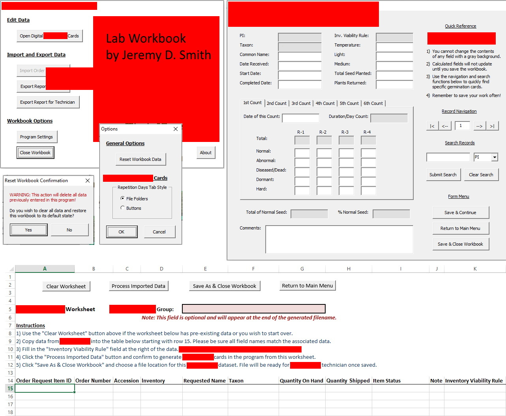

# zaydocLabWorkbook_Public

This is a Microsoft Excel VBA app I created for a data manager and laboratory technicians. It is designed to work in a 2-step process. First, the lab technicians record research data using the app with tablets or laptops. Then the technicians give the app with its data to the data manager. The data manager uses the app to review, transform, and prepare the lab data for export into a large company database. This app has markedly improved the efficiency of this process for everyone involved.

I am presenting this project both for my portfolio and to help others who may be facing challenges creating similar projects.
